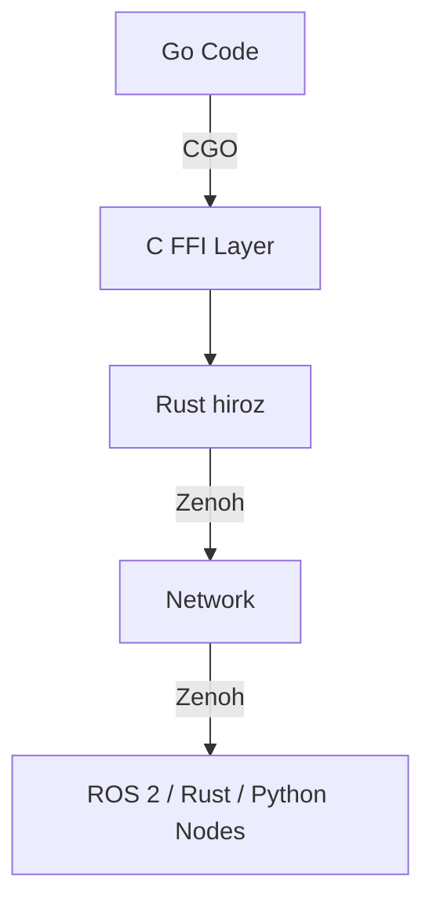

# Go Bindings

`hiroz-go` lets Go applications communicate with ROS 2 and Rust nodes over the same Eclipse Zenoh transport. It uses CGO to call the Rust FFI layer and exposes an idiomatic builder-pattern API.

!!! tip
    New here? Start with **[Quick Start](./go-quick-start.md)** to get a publisher and subscriber running in five minutes.

---

## Installation

### Pre-built Libraries (Recommended)

Download the pre-built static library for your platform from the [GitHub Releases](https://github.com/ZettaScaleLabs/hiroz/releases) page.
Artifacts are named `libhiroz-{distro}-{target}.a` (e.g. `libhiroz-jazzy-x86_64-unknown-linux-gnu.a`).

Each release also includes the C header `hiroz_ffi.h`.

Place the library somewhere stable (e.g. `vendor/libhiroz/`) and point CGO at it:

```bash
export CGO_LDFLAGS="-L/path/to/vendor/libhiroz -lhiroz -lm"
export CGO_CFLAGS="-I/path/to/vendor/libhiroz"
go build ./...
```

Or set them per-command:

```bash
CGO_LDFLAGS="-L$(pwd)/vendor/libhiroz -lhiroz -lm" \
CGO_CFLAGS="-I$(pwd)/vendor/libhiroz" \
go run main.go
```

Available targets:

| File | Platform |
|------|----------|
| `libhiroz-jazzy-x86_64-unknown-linux-gnu.a` | Linux x86_64, Jazzy |
| `libhiroz-humble-x86_64-unknown-linux-gnu.a` | Linux x86_64, Humble |
| `libhiroz-jazzy-aarch64-unknown-linux-gnu.a` | Linux ARM64, Jazzy |
| `libhiroz-humble-aarch64-unknown-linux-gnu.a` | Linux ARM64, Humble |
| `libhiroz-jazzy-aarch64-apple-darwin.a` | macOS Apple Silicon, Jazzy |
| `libhiroz-humble-aarch64-apple-darwin.a` | macOS Apple Silicon, Humble |

### Building from Source

Requires Rust (stable) and `cargo`:

```bash
cargo build --release --features ffi,jazzy --no-default-features -p hiroz
# Output: target/release/libhiroz.a
```

Then either use `${SRCDIR}`-relative `LDFLAGS` in the `go.mod` `replace` workflow (see below) or export `CGO_LDFLAGS` as shown above.

## Development Setup (replace directive)

Add to your `go.mod`:

```text
require github.com/ZettaScaleLabs/hiroz/crates/hiroz-go v0.0.0
replace github.com/ZettaScaleLabs/hiroz/crates/hiroz-go => /path/to/hiroz/crates/hiroz-go
```

The `#cgo LDFLAGS` in `hiroz/context.go` resolves the library via `${SRCDIR}` — no extra `CGO_LDFLAGS` needed with a `replace` directive.

**Generate message types** (no ROS 2 install needed for bundled types):

```bash
just -f crates/hiroz-go/justfile codegen-bundled   # std_msgs, geometry_msgs, example_interfaces
just -f crates/hiroz-go/justfile codegen            # full set from a ROS 2 installation
```

---

## Architecture



| Layer | Location | Role |
|-------|----------|------|
| **Go** | `hiroz/` package | Idiomatic API, builder pattern |
| **C FFI** | `hiroz_ffi.h` | Auto-generated by cbindgen |
| **Rust** | `ffi/` module | Bridges to hiroz core via Zenoh |

Callbacks flow in reverse: Rust invokes C function pointers → dispatched to Go via `//export` functions.

---

## Context

```go
ctx, err := hiroz.NewContext().WithDomainID(0).Build()
defer ctx.Close()
```

For cloud, Docker, or multi-machine deployments:

```go
ctx, err := hiroz.NewContext().
    WithMode(hiroz.ModeClient).
    WithConnectEndpoints("tcp/192.168.1.100:7447").
    DisableMulticastScouting().
    Build()
```

| Option | Description |
|--------|-------------|
| `WithDomainID(n)` | ROS domain ID (0–232) |
| `WithMode(mode)` | `ModePeer` (default) · `ModeClient` · `ModeRouter` |
| `WithConnectEndpoints(ep...)` | Explicit router addresses |
| `DisableMulticastScouting()` | Required in Docker / cloud |
| `ConnectToLocalZenohd()` | Shorthand for `tcp/127.0.0.1:7447` |
| `WithConfigFile(path)` | Zenoh JSON5 config file |
| `WithJSON(str)` | Inline Zenoh config as dotted-key JSON |
| `WithRemapRules(rules...)` | Topic/service remapping (`from:=to`) |
| `WithLogging()` | Initialise Zenoh tracing |

---

## Node

```go
node, err := ctx.CreateNode("talker").Build()
defer node.Close()

// Namespaced — all topics/services are prefixed
node, err := ctx.CreateNode("talker").WithNamespace("/robot").Build()

// Enable type description service (makes `ros2 topic info --verbose` work)
node, err := ctx.CreateNode("talker").WithTypeDescriptionService().Build()
```

---

## Pub / Sub

```go
// Publisher
pub, err := node.CreatePublisher("chatter").Build(&std_msgs.String{})
pub.Publish(&std_msgs.String{Data: "hello"})

// Subscriber — callback on Rust thread (keep it short)
sub, err := node.CreateSubscriber("chatter").
    BuildWithCallback(&std_msgs.String{}, func(data []byte) {
        msg := &std_msgs.String{}
        msg.DeserializeCDR(data)
        log.Println(msg.Data)
    })
```

Apply QoS with `.WithQoS(hiroz.QosSensorData())` on either builder.

---

## Services

```go
// Server
server, err := node.CreateServiceServer("add_two_ints").
    Build(&example_interfaces.AddTwoInts{}, func(reqBytes []byte) ([]byte, error) {
        var req example_interfaces.AddTwoIntsRequest
        req.DeserializeCDR(reqBytes)
        return (&example_interfaces.AddTwoIntsResponse{Sum: req.A + req.B}).SerializeCDR()
    })

// Client
client, err := node.CreateServiceClient("add_two_ints").
    Build(&example_interfaces.AddTwoInts{})
respBytes, err := client.Call(&example_interfaces.AddTwoIntsRequest{A: 5, B: 3})
// client.CallWithTimeout(req, 10*time.Second) for a custom timeout
var resp example_interfaces.AddTwoIntsResponse
if err := resp.DeserializeCDR(respBytes); err != nil {
    // handle error
}
// use resp.Sum
```

---

## Actions

```go
// Server
server, err := node.CreateActionServer("fibonacci").Build(
    &example_interfaces.Fibonacci{},
    func(goalBytes []byte) bool {         // accept / reject
        var g example_interfaces.FibonacciGoal
        g.DeserializeCDR(goalBytes)
        return g.Order > 0
    },
    func(h *hiroz.ServerGoalHandle, goalBytes []byte) ([]byte, error) {
        var g example_interfaces.FibonacciGoal
        g.DeserializeCDR(goalBytes)
        seq := []int32{0, 1}
        for i := 2; i < int(g.Order); i++ {
            seq = append(seq, seq[i-1]+seq[i-2])
            h.PublishFeedback(&example_interfaces.FibonacciFeedback{Sequence: seq})
        }
        return (&example_interfaces.FibonacciResult{Sequence: seq}).SerializeCDR()
    },
)

// Client
client, err := node.CreateActionClient("fibonacci").
    Build(&example_interfaces.Fibonacci{})
handle, err := client.SendGoal(&example_interfaces.FibonacciGoal{Order: 10})
resultBytes, err := handle.GetResult()
```

### Goal status

```go
handle.GetStatus()    // GoalStatusAccepted → GoalStatusSucceeded
handle.IsActive()     // true while executing
handle.IsTerminal()   // true when finished
handle.Cancel()       // request cancellation
```

### Cooperative cancellation

The execute callback runs in its own goroutine. Poll `IsCancelRequested()` at safe points:

```go
func(h *hiroz.ServerGoalHandle, goalBytes []byte) ([]byte, error) {
    // ...
    for i := 2; i < int(g.Order); i++ {
        if h.IsCancelRequested() {
            // return partial result and acknowledge cancel
            h.Canceled(&example_interfaces.FibonacciResult{Sequence: seq})
            return (&example_interfaces.FibonacciResult{Sequence: seq}).SerializeCDR()
        }
        // ... compute step
        time.Sleep(50 * time.Millisecond)
    }
    // ...
}
```

---

## Typed API

The typed helpers eliminate manual `SerializeCDR` / `DeserializeCDR` calls.

### Subscriber

```go
// Typed callback
sub, err := hiroz.BuildWithTypedCallback(
    node.CreateSubscriber("chatter"),
    func(msg *std_msgs.String) { log.Println(msg.Data) },
)

// Channel — range over messages
sub, ch, cleanup, err := hiroz.SubscriberWithChannel[*std_msgs.String](
    node.CreateSubscriber("chatter"), 10 /* buffer */)
defer cleanup(); defer sub.Close()
for msg := range ch { log.Println(msg.Data) }
```

Use `hiroz.NewRingChannel` (drops oldest on full) or `hiroz.NewFifoChannel` (blocks on full) with `SubscriberWithHandler` for explicit buffering control.

### Service

```go
// Typed server
server, err := hiroz.BuildTypedServiceServer(
    node.CreateServiceServer("add_two_ints"),
    &example_interfaces.AddTwoInts{},
    func(req *example_interfaces.AddTwoIntsRequest) (*example_interfaces.AddTwoIntsResponse, error) {
        return &example_interfaces.AddTwoIntsResponse{Sum: req.A + req.B}, nil
    },
)

// Typed call
resp := &example_interfaces.AddTwoIntsResponse{}
err := hiroz.CallTyped(client, &example_interfaces.AddTwoIntsRequest{A: 5, B: 3}, resp)
// hiroz.CallTypedWithTimeout(client, req, resp, 10*time.Second)
```

### Action

```go
// Typed server
server, err := hiroz.BuildTypedActionServer(
    node.CreateActionServer("fibonacci"), &example_interfaces.Fibonacci{},
    func(g *example_interfaces.FibonacciGoal) bool { return g.Order > 0 },
    func(h *hiroz.ServerGoalHandle, g *example_interfaces.FibonacciGoal) (*example_interfaces.FibonacciResult, error) {
        seq := []int32{0, 1}
        for i := 2; i < int(g.Order); i++ {
            if h.IsCancelRequested() {
                return &example_interfaces.FibonacciResult{Sequence: seq}, nil
            }
            seq = append(seq, seq[i-1]+seq[i-2])
        }
        return &example_interfaces.FibonacciResult{Sequence: seq}, nil
    },
)

// Typed client
client, err := hiroz.BuildTypedActionClient(node.CreateActionClient("fibonacci"), &example_interfaces.Fibonacci{})
handle, err := hiroz.SendTypedGoal(client, &example_interfaces.FibonacciGoal{Order: 10})
result := &example_interfaces.FibonacciResult{}
err = hiroz.GetTypedResult(handle, result)
```

---

## QoS

```go
hiroz.QosDefault()          // Reliable, Volatile, KeepLast(10)
hiroz.QosSensorData()       // BestEffort, Volatile, KeepLast(5) — high-rate streams
hiroz.QosServicesDefault()  // Reliable, Volatile, KeepLast(10)
hiroz.QosTransientLocal()   // Reliable, TransientLocal, KeepLast(1) — /tf_static, /robot_description
hiroz.QosKeepAll()          // Reliable, Volatile, KeepAll
```

Apply with `.WithQoS(profile)` on the publisher or subscriber builder.

!!! tip
    Match QoS profiles on both sides. BestEffort publisher + Reliable subscriber will not exchange messages.

---

## Graph Introspection

```go
topics, _ := node.GetTopicNamesAndTypes()    // map[string][]string
names, _  := node.GetNodeNames()             // []string
services, _ := node.GetServiceNamesAndTypes()
exists, _ := node.NodeExists("talker")
```

Requires a Zenoh router and a brief settling time after nodes come online.

---

## Error Handling

All `Build()` calls and operations return `error`. Use `errors.Is()` with sentinel values:

| Sentinel | When raised |
|----------|-------------|
| `hiroz.ErrBuildFailed` | `Build()` failed — FFI returned nil |
| `hiroz.ErrTimeout` | Service call timed out |
| `hiroz.ErrGoalRejected` | Action server rejected the goal |
| `hiroz.ErrResultFailed` | Could not retrieve action result |
| `hiroz.ErrCancelFailed` | Cancellation request failed |

```go
if errors.Is(err, hiroz.ErrBuildFailed) { /* construction failed */ }
if errors.Is(err, hiroz.ErrTimeout)     { /* no server responded */ }
```

Inspect the error code directly when you need fine-grained handling:

```go
var e hiroz.HirozError
if errors.As(err, &e) {
    switch e.Code() {
    case hiroz.ErrorCodeServiceTimeout:
        // retry
    default:
        log.Fatalf("FFI error %d: %s", e.Code(), e.Message())
    }
}
```

!!! warning
    C/Rust threads invoke callbacks. Do **not** call `log.Fatal` or block inside them — send to a channel or set an atomic flag instead.

---

## Logging & Debugging

Set `HIROZ_LOG` to control the hiroz package log level:

```bash
HIROZ_LOG=debug go run main.go   # all callbacks, CDR lengths, FFI calls
HIROZ_LOG=info  go run main.go   # lifecycle events
HIROZ_LOG=warn  go run main.go   # default — silent in production
HIROZ_LOG=error go run main.go   # errors only
```

Logs go to stderr via Go's `log/slog` structured text format. For Zenoh-level tracing add `WithLogging()` to the context builder and set `RUST_LOG=zenoh=debug`.

---

## Examples

| Example | Demonstrates |
|---------|-------------|
| `publisher/` | Basic publish loop |
| `subscriber/` | Typed callback subscriber |
| `subscriber_channel/` | Channel-based, `range`-friendly |
| `service_server/` | AddTwoInts server |
| `service_client/` | Synchronous call |
| `service_client_errors/` | Timeouts, retries, sentinel errors |
| `action_server/` | Fibonacci server with feedback |
| `action_client/` | Send goal · monitor feedback · get result |
| `action_client_errors/` | Rejected goals, cancellation |
| `production_service/` | Graceful shutdown, circuit breaker, metrics |

```bash
just -f crates/hiroz-go/justfile run-example <name>
```

See `crates/hiroz-go/examples/production_service/README.md` for the production walkthrough.

---

## Further Reading

- **[Pub/Sub](../core-concepts/pubsub.md)** — QoS theory, ROS 2 interop requirements
- **[Services](../core-concepts/services.md)** — Service concepts
- **[Actions](../core-concepts/actions.md)** — Action lifecycle
- **[Message Generation](../user-guide/message-generation.md)** — Generating types from IDL
- **[Interop Tests](../user-guide/go_interop_tests.md)** — Test suite details
