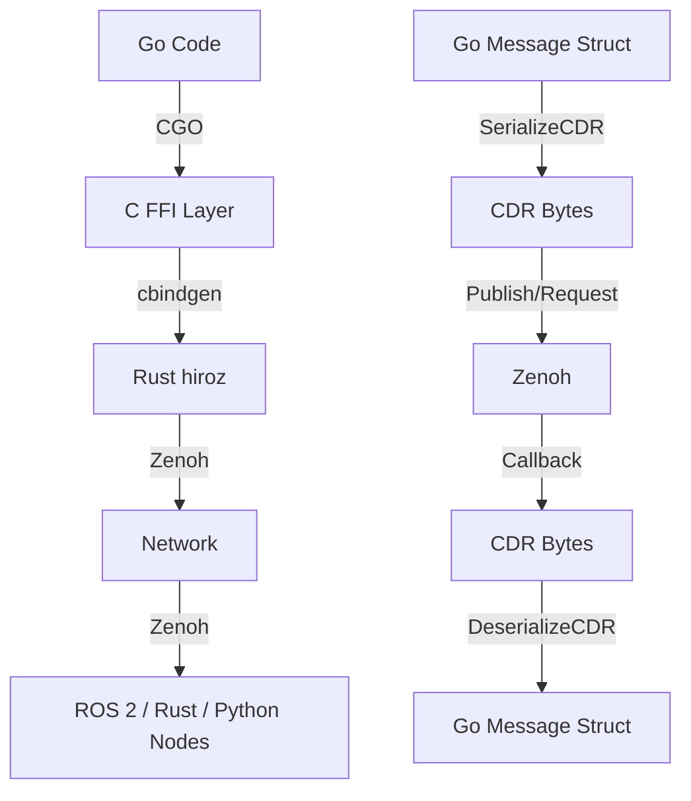

# Go Bindings

**hiroz provides Go bindings via `hiroz-go`, enabling Go applications to communicate with Rust and ROS 2 nodes using the same Zenoh transport.** The bindings use CGO to call the Rust FFI layer and provide idiomatic Go APIs for pub/sub, services, and actions.

```admonish note
Go bindings use the same Zenoh transport as Rust nodes. Messages are serialized/deserialized using CDR format for full ROS 2 compatibility.
```

```admonish success title="Production Ready"
Phase 1 and Phase 2 improvements (v0.2+) provide memory safety via `cgo.Handle` and `runtime.Pinner`, structured error handling with `HirozError`, and flexible message delivery via the `Handler[T]` interface.
```

## 30-Second Quickstart

**Want to jump right in?**

```bash
# One-command setup (no ROS 2 required!)
just -f crates/hiroz-go/justfile quickstart

# Run a live demo (publisher + subscriber)
just -f crates/hiroz-go/justfile demo
```

You'll see a publisher sending messages and a subscriber receiving them. **No ROS 2 installation required!**

The quickstart command:

1. Builds the Rust FFI library
2. Generates common message types from bundled IDL (std_msgs, geometry_msgs, example_interfaces)
3. Runs verification tests

After quickstart, you'll have:

```text
target/release/libhiroz.a          # Rust FFI library
crates/hiroz-go/hiroz/hiroz_ffi.h   # C header (auto-generated)
crates/hiroz-go/generated/         # Go message types
  ├── std_msgs/
  ├── geometry_msgs/
  └── example_interfaces/
```

For troubleshooting, see [Common Errors](#common-errors) below.

## Architecture

### Visual Flow



### Memory Safety

**hiroz-go uses modern Go features for safe CGO interop:**

- **`cgo.Handle` (Go 1.17+)**: Type-safe callback storage with GC integration
  - Replaces manual callback registries
  - Prevents memory leaks via automatic cleanup
  - No mutex contention on callback invocations

- **`runtime.Pinner` (Go 1.21+)**: Prevents GC relocation of byte slices during CGO calls
  - Applied to all outgoing data (Publish, Call, SendGoal)
  - Ensures pointer validity across the Go/C boundary
  - Automatic unpinning via defer

## Installation

### Prerequisites

- **Go 1.23+** (for runtime.Pinner, generics)
- **Rust toolchain** (1.75+)
- **cbindgen** (`cargo install cbindgen`)
- **just** (`cargo install just`)

### Build

```bash
# Build the Rust FFI library
just build-rust

# Build Go bindings
cd crates/hiroz-go && go build ./...

# Run tests
just test-go
```

The Rust library is compiled with the `ffi` feature, which auto-generates the C header via cbindgen.

### Code Generation

To use standard ROS 2 message types:

```bash
# Generate message types (requires ROS 2 installation for IDL files)
just codegen
```

This produces Go message structs in `crates/hiroz-go/generated/` with CDR serialization.

## Quick Start

### Publisher

```go
package main

import (
    "fmt"
    "log"
    "time"

    "github.com/ZettaScaleLabs/hiroz/crates/hiroz-go/hiroz"
    "github.com/ZettaScaleLabs/hiroz/crates/hiroz-go/generated/std_msgs"
)

func main() {
    ctx, _ := hiroz.NewContext().WithDomainID(0).Build()
    defer ctx.Close()

    node, _ := ctx.CreateNode("go_talker").Build()
    defer node.Close()

    pub, _ := node.CreatePublisher("chatter").Build(&std_msgs.String{})
    defer pub.Close()

    for i := 0; ; i++ {
        msg := &std_msgs.String{Data: fmt.Sprintf("Hello #%d", i)}
        if err := pub.Publish(msg); err != nil {
            log.Printf("Publish error: %v", err)
        }
        time.Sleep(100 * time.Millisecond)
    }
}
```

### Subscriber (Callback)

```go
func main() {
    ctx, _ := hiroz.NewContext().WithDomainID(0).Build()
    defer ctx.Close()

    node, _ := ctx.CreateNode("go_listener").Build()
    defer node.Close()

    node.CreateSubscriber("chatter").
        BuildWithCallback(&std_msgs.String{}, func(data []byte) {
            var msg std_msgs.String
            msg.DeserializeCDR(data)
            log.Printf("Received: %s", msg.Data)
        })

    select {} // Keep alive
}
```

### Subscriber (Channel)

```go
func main() {
    ctx, _ := hiroz.NewContext().WithDomainID(0).Build()
    defer ctx.Close()

    node, _ := ctx.CreateNode("go_listener").Build()
    defer node.Close()

    // Create a channel handler
    handler := hiroz.NewFifoChannel[[]byte](10)
    callback, drop, ch := handler.ToCbDropHandler()
    defer drop()

    node.CreateSubscriber("chatter").
        BuildWithCallback(&std_msgs.String{}, callback)

    // Process messages from channel
    for data := range ch {
        var msg std_msgs.String
        msg.DeserializeCDR(data)
        log.Printf("Received: %s", msg.Data)
    }
}
```

### Typed Subscribers (Automatic Deserialization)

**New in v0.2+**: Eliminate manual deserialization with typed subscriber functions:

#### Option 1: Typed Callback

```go
sub, err := hiroz.BuildWithTypedCallback(
    node.CreateSubscriber("chatter"),
    func(msg *std_msgs.String) {
        log.Printf("Received: %s", msg.Data)  // Already deserialized!
    })
defer sub.Close()
```

**Note:** Uses standalone generic function (Go doesn't support type parameters on methods).

#### Option 2: Typed Channel

```go
sub, ch, cleanup, err := hiroz.SubscriberWithChannel[*std_msgs.String](
    node.CreateSubscriber("chatter"), 10)
defer cleanup()  // Close the channel
defer sub.Close()

for msg := range ch {
    log.Printf("Received: %s", msg.Data)  // Type-safe, auto-deserialized
}
```

**Note:** Returns a cleanup function to close the channel when done.

#### Option 3: Typed Handler Integration

```go
handler := hiroz.NewFifoChannel[*std_msgs.String](10)
sub, ch, cleanup, err := hiroz.SubscriberWithHandler(
    node.CreateSubscriber("chatter"), handler)
defer cleanup()  // Close the handler
defer sub.Close()

for msg := range ch {
    log.Printf("Received: %s", msg.Data)
}
```

All three methods automatically deserialize messages and handle errors internally (malformed messages are dropped).

## Error Handling

### Structured Errors

**hiroz-go provides `HirozError` for programmatic error handling:**

```go
import "github.com/ZettaScaleLabs/hiroz/crates/hiroz-go/hiroz"

// Service call with error handling
resp, err := client.Call(req)
if err != nil {
    if hirozErr, ok := err.(hiroz.HirozError); ok {
        switch hirozErr.Code() {
        case hiroz.ErrorCodeServiceTimeout:
            // Retry logic
            log.Println("Service timed out, retrying...")
        case hiroz.ErrorCodeServiceCallFailed:
            // Handle service failure
            log.Printf("Service failed: %s", hirozErr.Message())
        default:
            // General error handling
            log.Fatalf("Service error: %v", hirozErr)
        }
    }
}
```

### Error Codes

Key error codes defined in `hiroz/error.go`:

- `ErrorCodeSuccess` (0) - Operation completed successfully
- `ErrorCodeServiceTimeout` (-10) - Service call timed out
- `ErrorCodeServiceCallFailed` (-9) - Service call failed
- `ErrorCodeActionGoalRejected` (-11) - Action goal rejected by server
- `ErrorCodePublishFailed` (-4) - Message publishing failed
- `ErrorCodeSerializationFailed` (-5) - CDR serialization failed

### Convenience Methods

```go
if err.(hiroz.HirozError).IsTimeout() {
    // Handle timeout specifically
}

if err.(hiroz.HirozError).IsRejected() {
    // Handle action goal rejection
}
```

### Retry Pattern

```go
const maxRetries = 3
for attempt := 1; attempt <= maxRetries; attempt++ {
    resp, err := client.Call(req)
    if err == nil {
        break // Success
    }

    if hirozErr, ok := err.(hiroz.HirozError); ok && hirozErr.IsTimeout() {
        if attempt < maxRetries {
            backoff := time.Duration(attempt) * time.Second
            log.Printf("Timeout, retrying in %v...", backoff)
            time.Sleep(backoff)
            continue
        }
    }

    return err // Give up
}
```

## Handler Interface

hiroz-go supports three message delivery patterns via the `Handler[T]` interface:

### 1. Closure (Direct Callback)

```go
handler := hiroz.NewClosure(
    func(data []byte) { processMessage(data) },
    func() { cleanup() },
)
```

- **Pros**: Zero allocation, lowest latency
- **Cons**: Blocks Zenoh thread, no concurrency
- **Use**: Simple processing, < 1ms per message

### 2. FifoChannel (Buffered, Blocking)

```go
handler := hiroz.NewFifoChannel[[]byte](10)
callback, drop, ch := handler.ToCbDropHandler()
defer drop()

sub.BuildWithCallback(msg, callback)
for data := range ch {
    // Process with backpressure control
}
```

- **Pros**: Backpressure control, enables batching
- **Cons**: Blocks sender when full
- **Use**: Reliable delivery, I/O-bound work

### 3. RingChannel (Non-blocking, Drops Oldest)

```go
handler := hiroz.NewRingChannel[[]byte](5)
callback, drop, ch := handler.ToCbDropHandler()
defer drop()

sub.BuildWithCallback(msg, callback)
for data := range ch {
    // Always fresh data, older messages dropped
}
```

- **Pros**: Never blocks, always fresh data
- **Cons**: Can drop messages
- **Use**: Real-time systems, position updates

### Comparison Table

| Handler Type | Latency | Blocking | Drops | Concurrency | Use Case |
|--------------|---------|----------|-------|-------------|----------|
| Closure | Lowest | N/A | No | Single thread | Fast callbacks |
| FifoChannel | Low | Yes (full) | No | Multi-thread | Reliable delivery |
| RingChannel | Low | No | Yes (oldest) | Multi-thread | Real-time updates |

## Services

### Service Client

```go
svc := &example_interfaces.AddTwoInts{}
client, _ := node.CreateServiceClient("add_two_ints").Build(svc)
defer client.Close()

req := &example_interfaces.AddTwoIntsRequest{A: 5, B: 3}
respBytes, err := client.Call(req)
if err != nil {
    log.Fatalf("Service call failed: %v", err)
}

var resp example_interfaces.AddTwoIntsResponse
resp.DeserializeCDR(respBytes)
log.Printf("Result: %d", resp.Sum)
```

### Service Server

```go
svc := &example_interfaces.AddTwoInts{}
server, _ := node.CreateServiceServer("add_two_ints").
    Build(svc, func(reqData []byte) ([]byte, error) {
        var req example_interfaces.AddTwoIntsRequest
        req.DeserializeCDR(reqData)

        resp := &example_interfaces.AddTwoIntsResponse{
            Sum: req.A + req.B,
        }
        return resp.SerializeCDR()
    })
defer server.Close()
```

## Actions

### Action Client

```go
action := &example_interfaces.Fibonacci{}
client, _ := node.CreateActionClient("fibonacci").Build(action)
defer client.Close()

goal := &example_interfaces.FibonacciGoal{Order: 10}
goalHandle, err := client.SendGoal(goal)
if err != nil {
    if hirozErr, ok := err.(hiroz.HirozError); ok && hirozErr.IsRejected() {
        log.Println("Goal was rejected by server")
        return
    }
    log.Fatalf("Failed to send goal: %v", err)
}

resultBytes, _ := goalHandle.GetResult()
var result example_interfaces.FibonacciResult
result.DeserializeCDR(resultBytes)
log.Printf("Sequence: %v", result.Sequence)
```

### Action Server

```go
action := &example_interfaces.Fibonacci{}
server, _ := node.CreateActionServer("fibonacci").Build(
    action,
    // Goal callback (accept/reject)
    func(goalData []byte) bool {
        var goal example_interfaces.FibonacciGoal
        goal.DeserializeCDR(goalData)
        return goal.Order > 0 && goal.Order < 20 // Accept if valid
    },
    // Execute callback
    func(goalData []byte, feedback chan<- []byte) ([]byte, error) {
        var goal example_interfaces.FibonacciGoal
        goal.DeserializeCDR(goalData)

        // Compute Fibonacci sequence
        sequence := []int32{0, 1}
        for i := 2; i <= int(goal.Order); i++ {
            sequence = append(sequence, sequence[i-1]+sequence[i-2])

            // Publish feedback
            fb := &example_interfaces.FibonacciFeedback{
                PartialSequence: sequence,
            }
            fbBytes, _ := fb.SerializeCDR()
            feedback <- fbBytes
        }

        // Return result
        result := &example_interfaces.FibonacciResult{
            Sequence: sequence,
        }
        return result.SerializeCDR()
    },
)
defer server.Close()
```

## Testing

### Test Organization

```bash
# Pure Go tests (no FFI dependencies)
just test-go-pure  # 30 tests - message serialization, interfaces

# FFI unit tests (requires libhiroz.a)
just test-go-ffi   # 26 tests - error handling, callbacks, handlers

# All Go tests
just test-go       # 56 tests total

# Integration tests (requires zenohd router)
just test-integration  # 11 tests - ROS 2 interop
```

### Running Specific Tests

```bash
cd crates/hiroz-go/hiroz
go test -v -run TestHirozError
go test -v -run TestHandler
```

## Examples

The `crates/hiroz-go/examples/` directory contains comprehensive examples:

### Basic Examples

- **publisher** - Publish messages at 10 Hz
- **subscriber** - Subscribe with callback
- **service_client** - Call AddTwoInts service
- **service_server** - Implement AddTwoInts service
- **action_client** - Send Fibonacci goal
- **action_server** - Execute Fibonacci actions

### Advanced Examples

- **subscriber_channel** - Handler interface patterns (FIFO, Ring, Direct)
- **service_client_errors** - Structured error handling with retry logic
- **action_client_errors** - Action-specific error handling

### Production Example

- **production_service/** - Complete production-ready service implementation

Demonstrates:

- **Server**: Rate limiting, panic recovery, graceful shutdown, metrics, health monitoring
- **Client**: Retry with exponential backoff, context cancellation, latency tracking
- **Structured logging**: JSON logs with `log/slog`
- **Thread-safe storage**: RWMutex-based cache
- **Observability**: Real-time metrics, health checks, error tracking

Run the demo:

```bash
just -f crates/hiroz-go/justfile demo-production
```

See `examples/production_service/README.md` for detailed pattern explanations and deployment checklist.

### Running Examples

```bash
# Build Rust library first
just build-rust

# Run an example
cd crates/hiroz-go/examples/publisher
CGO_LDFLAGS="-L../../../target/release" go run main.go
```

## Advanced Topics

### Concurrent Message Processing

Using channels enables elegant concurrent patterns:

```go
handler := hiroz.NewFifoChannel[[]byte](100)
callback, drop, ch := handler.ToCbDropHandler()
defer drop()

sub.BuildWithCallback(msg, callback)

// Worker pool pattern
const numWorkers = 4
var wg sync.WaitGroup
for i := 0; i < numWorkers; i++ {
    wg.Add(1)
    go func(id int) {
        defer wg.Done()
        for data := range ch {
            processMessage(id, data)
        }
    }(i)
}

// Shutdown
sub.Close()
wg.Wait()
```

### Custom Message Types

For custom messages, implement the `Message` interface:

```go
type Message interface {
    TypeName() string
    TypeHash() string
    SerializeCDR() ([]byte, error)
    DeserializeCDR([]byte) error
}
```

See `crates/hiroz-go/testdata/` for examples of hand-written message types.

## Performance Considerations

### Callback vs Channel

**Direct callbacks (`Closure`):**

- Zero allocation for message delivery
- Executes in Zenoh callback thread
- Best for low-latency requirements (< 1ms per message)
- Keep callback work minimal

**Channel-based (`FifoChannel`, `RingChannel`):**

- Single allocation per message (copy to channel)
- Decouples Zenoh thread from processing
- Better for CPU-intensive work
- Enables concurrent processing

**Recommendations:**

- Use `Closure` for < 1ms processing per message
- Use `FifoChannel` for batching or I/O-bound work
- Use `RingChannel` for real-time systems with fresh-data requirements

## Migration Guide (v0.1 → v0.2+)

### No Breaking Changes

Existing code continues to work. New features are opt-in.

### Opting Into New Features

**Error Handling:**

```go
// Before (still works)
if err := client.Call(req); err != nil {
    log.Fatalf("Call failed: %v", err)
}

// After (with structured errors)
if err := client.Call(req); err != nil {
    if hirozErr, ok := err.(hiroz.HirozError); ok {
        if hirozErr.IsTimeout() {
            // Handle timeout specifically
        }
    }
}
```

**Channel-Based Delivery:**

```go
// Before (still works)
sub.BuildWithCallback(msg, func(data []byte) {
    processMessage(data)
})

// After (with channels)
handler := hiroz.NewFifoChannel[[]byte](10)
callback, drop, ch := handler.ToCbDropHandler()
defer drop()
sub.BuildWithCallback(msg, callback)
for data := range ch {
    processMessage(data)
}
```

## Common Errors

Quick reference for common issues and solutions:

| Error | Cause | Solution |
|-------|-------|----------|
| `undefined reference to hiroz_*` | Rust FFI library not built | Run `just build-rust` or `cargo build --release --features ffi` |
| `cannot find package generated` | Messages not generated | Run `just -f crates/hiroz-go/justfile codegen-bundled` |
| `ld: library not found for -lhiroz` | Wrong CGO_LDFLAGS path | Use `just run-example <name>` instead of direct `go run` |
| Type hash mismatch with ROS 2 | Message definition version mismatch | Check ROS distro compatibility, enable `RUST_LOG=hiroz=debug` |
| Import cycle error | Circular dependencies | Check package structure, avoid cross-imports |
| Subscriber receives no messages | Type mismatch or network issue | Verify type hashes, check Zenoh router connection |

### Verifying Your Setup

```bash
# Check all prerequisites
just -f crates/hiroz-go/justfile verify
```

This checks:

- ✓ libhiroz.a exists
- ✓ hiroz_ffi.h exists
- ✓ Generated messages exist

## Troubleshooting

### CGO Linker Errors

**Symptom**: `undefined reference to hiroz_*` or `ld: library not found`

**Solution**:

```bash
# Ensure Rust library is built with FFI features
just build-rust

# Or manually
cargo build --release --features ffi

# For examples, use the helper (handles CGO_LDFLAGS automatically)
just -f crates/hiroz-go/justfile run-example publisher
```

### Type Hash Mismatches

**Symptom**: Messages aren't received from ROS 2 nodes

**Solution**: Check type hashes match:

```bash
# Enable debug logging to see type hashes
RUST_LOG=hiroz=debug cargo run --example publisher
```

Look for `RIHS01_` hash in logs and compare with ROS 2:

```bash
ros2 interface show std_msgs/msg/String
```

The hash after `RIHS01_` must match exactly between hiroz and ROS 2.

### Performance Issues

- Use `Closure` for lowest latency (< 100µs)
- Use `RingChannel` for real-time systems (always fresh data)
- Increase buffer sizes for `FifoChannel` if messages are dropped
- Consider using `BuildWithTypedCallback` to avoid manual deserialization overhead

## Frequently Asked Questions

### Do I need ROS 2 installed?

**No!** hiroz-go uses bundled message definitions for common types (std_msgs, geometry_msgs, example_interfaces).

You only need ROS 2 if you want to:

- Generate messages from your own `.msg` files
- Use message types not in the bundled set
- Test interoperability with actual ROS 2 nodes

### Do I need a Zenoh router?

**No for local testing.** Messages work between hiroz nodes on the same machine without a router.

Use a router for:

- Communication across multiple machines
- ROS 2 interop via rmw_zenoh
- Production deployments with discovery and routing

### Why do examples use CGO_LDFLAGS?

Go needs to know where `libhiroz.a` lives for CGO linking. The helper commands handle this automatically:

```bash
# Instead of:
CGO_LDFLAGS="-L../../target/release" go run .

# Use:
just -f crates/hiroz-go/justfile run-example publisher
```

### How does hiroz-go compare to other ROS Go libraries?

| Feature | hiroz-go | rclgo | rclpy (Python) |
|---------|----------|-------|----------------|
| **ROS 2 dependency** | Optional | Required | Required |
| **Performance** | High (Zenoh) | Medium (DDS) | Low (Python) |
| **Concurrency** | Native goroutines | Limited | GIL-limited |
| **Message generation** | IDL → Go | ROS → Go | ROS → Python |
| **Memory safety** | Go + Rust | Go + C++ | Python GC |
| **Learning curve** | Medium | High | Low |
| **Best for** | Cloud-native, high-perf | ROS 2 integration | Prototyping |

### Can I use hiroz-go in production?

**Yes.** Phase 2 improvements provide:

- Memory-safe CGO interop (`cgo.Handle`, `runtime.Pinner`)
- Structured error handling (`HirozError`)
- Flexible message delivery patterns (Closure, FIFO, Ring)
- Full test coverage (56 Go tests + integration tests)

## Helper Commands Reference

```bash
# Setup
just -f crates/hiroz-go/justfile quickstart   # One-command setup
just -f crates/hiroz-go/justfile verify       # Check installation

# Code Generation
just -f crates/hiroz-go/justfile codegen-bundled  # Generate common messages

# Running Examples
just -f crates/hiroz-go/justfile run-example <name>  # Run any example
just -f crates/hiroz-go/justfile demo         # Live pub/sub demo

# Building
just build-rust                               # Build Rust FFI library
cd crates/hiroz-go && go build ./...         # Build Go packages
```

## References

- **Source**: [`hiroz-go/hiroz/`](https://github.com/ZettaScaleLabs/hiroz/tree/main/crates/hiroz-go/hiroz)
- **Examples**: [`hiroz-go/examples/`](https://github.com/ZettaScaleLabs/hiroz/tree/main/crates/hiroz-go/examples)
- **Tests**: [`hiroz-go/hiroz/*_test.go`](https://github.com/ZettaScaleLabs/hiroz/tree/main/crates/hiroz-go/hiroz)
- **FFI Layer**: [`hiroz/src/ffi/`](https://github.com/ZettaScaleLabs/hiroz/tree/main/crates/hiroz/src/ffi)
